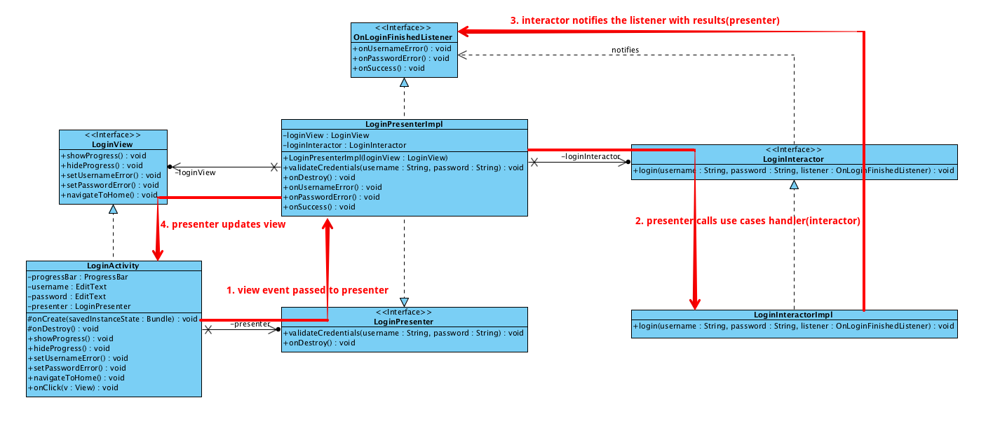

How it Works
==========

1. View(Activity, Fragment, ...) calls presenter methods whenever there're user interaction
2. Presenter implementation calls the interactor(use case handler) to get results from business/domain layer
3. Interactor implementation returns the results or just returns the control to presenter implementation by calling listener methods
4. Presenter implementation calls view methods to update the UI by calling view interface.

View, Presenter, Interactor and Listener interfaces are used to remove tight coupling.

View becomes too humble to test. We can use fake(simulator) presenter to test view.

Presenter and Interactor can be tested.

1.视图（Activity，Fragment，...）在用户交互时调用presenter方法

2.presenter实现调用interactor（用例处理程序）从业务/域层获取结果

3.Interactor实现返回结果或通过调用监听器方法仅将控件返回给presenter实现

4.Presenter实现通过调用视图界面来调用视图方法来更新UI。

View，Presenter，Interactor和Listener接口用于消除紧密耦合。

视图变得太谦虚，无法测试。 我们可以使用假（模拟器）演示者来测试视图。

演示者和交互者可以被测试。
